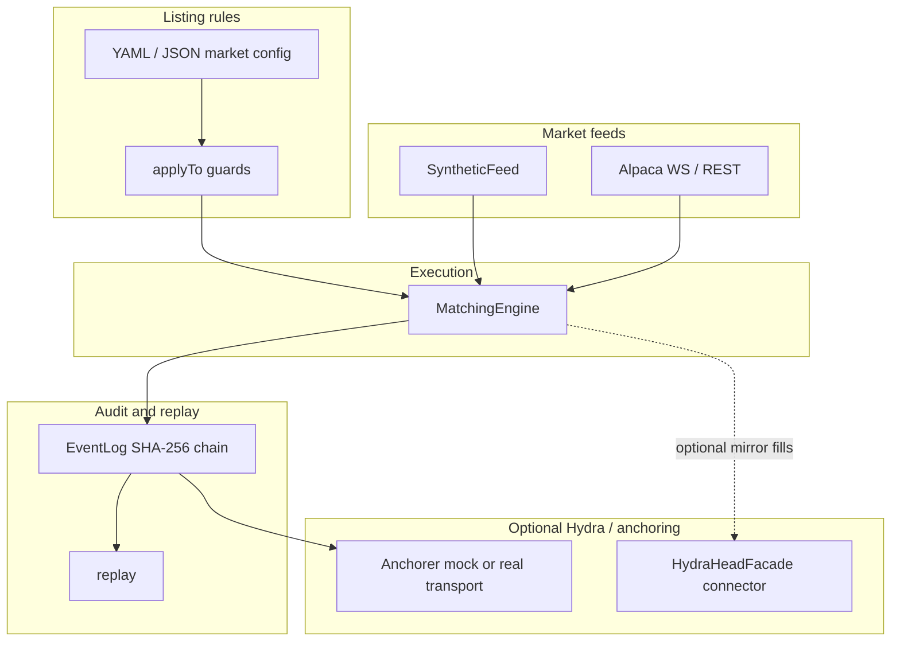
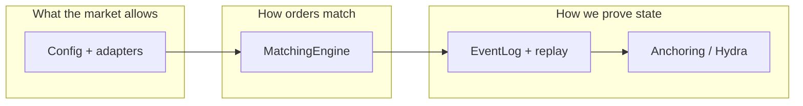
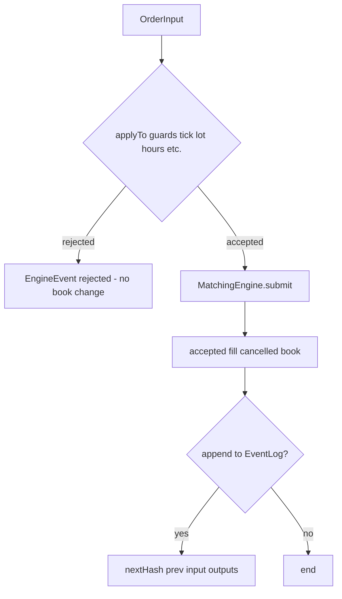
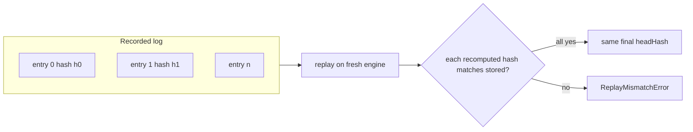
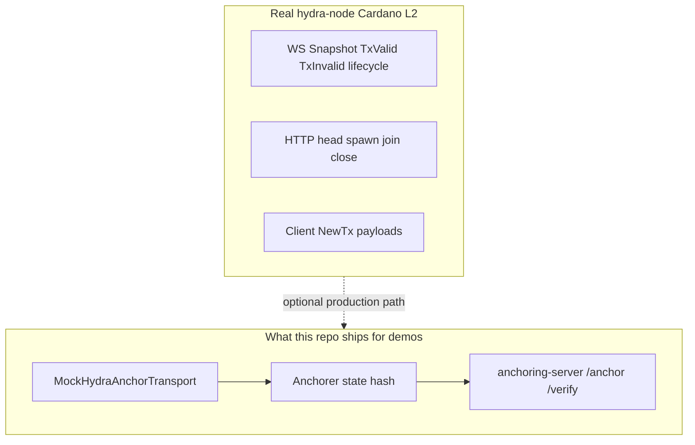
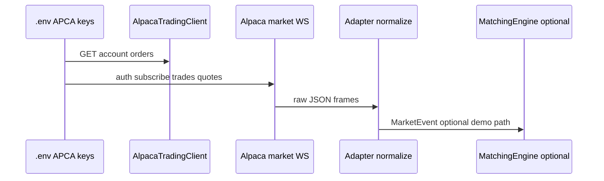
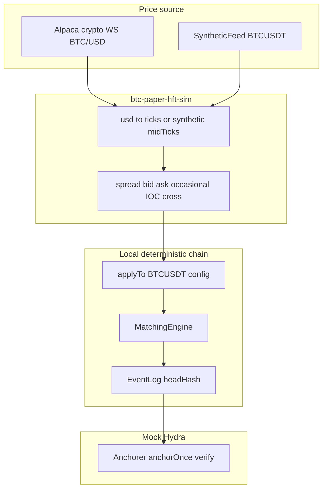
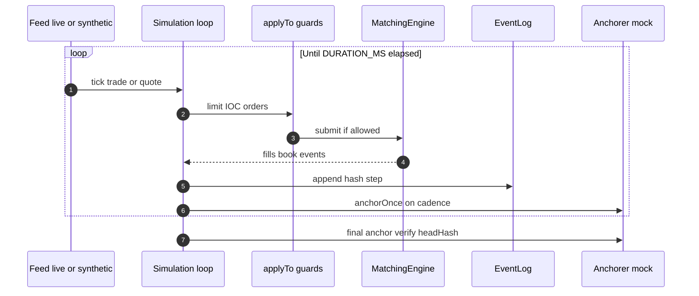

# Hydra Wall Street Library - how it works, why it's useful, lifecycle, and the 5-minute BTC run

This document explains what the **Hydra Wall Street Library** monorepo is for, how the pieces fit together, how data and control flow through the system, and what the **`examples/btc-paper-hft-sim.mjs`** "five-minute BTC Wall Street run" is doing, including how it relates to **Hydra** for off-chain head and L2-style anchoring, and to **Alpaca** for market data and optional brokerage APIs.

---

## 1. What this library is

The library is a **deterministic trading simulation stack**:

- A **price-time matching engine** (limit, IOC, cancel, partial fills).
- A **rolling hash event log** so each batch of inputs and outputs can be **replayed** on a fresh engine with an identical final state (auditability and regression testing).
- **Market configuration** (YAML/JSON): tick size, lot size, trading hours, holidays, halts - applied before orders reach the matcher.
- **Adapters** that turn **synthetic** ticks or **Alpaca** market frames into a single **`MarketEvent`** shape.
- **Hydra connector + anchoring**: tools to talk to a **hydra-node** WebSocket in a finance-friendly way, and to **commit hashes** of engine state (mock transport in dev/CI; real node when configured).
- **Apps**: `engine-server` (HTTP + WebSocket), `anchoring-server`, **React** UI, **Python** SDK with an embedded matcher for research/backtests.
- **Docker + CI** so builds and smoke flows stay reproducible.

It is **not** a turnkey regulated exchange or a guaranteed profitable trading bot. It **does not custody assets**. Alpaca keys are for **paper** or controlled integration testing.

### Visual: layers from feeds to proof



---

## 2. Why it's useful

| Audience | Benefit |
|----------|---------|
| **Cardano / Hydra builders** | Reference patterns for **deterministic execution**, **hash-linked logs**, and **Hydra-compatible** messaging - without building a matching engine from scratch. |
| **Quants & researchers** | Same rules run in **TypeScript** and **Python** (`LocalMatchingEngine`) with identical semantics for strategy replay. |
| **Educators** | End-to-end story: market data → normalized events → guarded orders → matcher → tape/book/P&amp;L → optional anchoring. |
| **DevOps / QA** | CI runs unit tests, scenario scripts, Docker builds; logs can be regenerated from `docs/development/scripts/`. |

The useful core idea: **separate "what the market allows" (config + adapters) from "how orders match" (engine) from "how we prove state" (hash chain + optional Hydra/L1 anchoring).**

### Visual: those three concerns



---

## 3. Major packages (mental model)

| Package / app | Role |
|---------------|------|
| `@hydra-ws/core` | `MatchingEngine`, `EventLog`, `replay`, `SyntheticFeed`, `MarketEvent`. |
| `@hydra-ws/market-config` | Load YAML/JSON; `applyTo(engine, cfg)` enforces listing rules. |
| `@hydra-ws/adapters-alpaca` | REST trading client; **IEX-style** WebSocket adapter + normalizer (equities path in stock scripts). |
| `@hydra-ws/hydra-connector` | WS + HTTP helpers, reconnect policy, parsing Hydra server outputs. |
| `@hydra-ws/anchoring` | `Anchorer` + transports (mock or wired to a head facade). |
| `@hydra-ws/sdk` | **`HydraWallStreetSession`**: ties engine + optional Alpaca + optional Hydra facade. |
| `apps/engine-server` | HTTP API and `/stream/:symbol` WebSocket for external clients. |
| `apps/web` | Operator/demo UI. |
| `packages/sdk-python` | `EngineClient` + embedded matcher. |

### Visual: packages and apps

```mermaid
flowchart TB
  subgraph apps["Applications"]
    WEB[apps/web]
    ENGSRV[engine-server]
    ASRV[anchoring-server]
  end

  subgraph sdk["SDK façade"]
    TS[@hydra-ws/sdk HydraWallStreetSession]
  end

  subgraph libs["Libraries"]
    CORE[@hydra-ws/core]
    MC[@hydra-ws/market-config]
    ALP[@hydra-ws/adapters-alpaca]
    HY[@hydra-ws/hydra-connector]
    ANCH[@hydra-ws/anchoring]
  end

  subgraph py["Python"]
    PY[sdk-python hydra_ws_sdk]
  end

  WEB --> ENGSRV
  ENGSRV --> TS
  TS --> CORE
  TS --> ALP
  TS --> HY
  MC --> CORE
  ANCH --> HY
  PY --> CORE
  ASRV --> ANCH
```

---

## 4. Lifecycles

### 4.1 Order lifecycle (local matcher)

1. **Input**: `OrderInput` (limit / IOC / cancel) with symbol, side, `priceTicks`, quantity, id.
2. **Guards**: `applyTo` may **reject** (tick/lot/hours/holiday/halt) without touching book state.
3. **Match**: Price-time queues; emits **accepted**, **fill**, **cancelled**, **book** updates.
4. **Optional logging**: Append `(input, outputs)` to `EventLog`; each step updates a **SHA-256 chain** over canonical JSON.

**Visual: order path**



### 4.2 Replay lifecycle

1. Record ordered inputs + outputs (or re-derive outputs by resubmitting inputs if you trust the engine only).
2. `replay(log)` reapplies inputs; recomputes hashes; **throws** if any step diverges.
3. Used in `examples/scenario-trade.mjs` and CI for regression.

**Visual: replay check**



### 4.3 "Hydra" lifecycle (as used in this repo)

There are **two different concepts** people call "Hydra":

1. **Hydra Head / hydra-node** - real Cardano L2 process: WebSocket events (`Snapshot`, `TxValid`, …), HTTP control, eventual **fanout** to L1. The repo's **`HydraHeadFacade`** connects and sends **`NewTx`** payloads when you mirror fills or custom txs.
2. **Anchoring service (this project)** - **`Anchorer`** submits a **state hash** through a transport; **`MockHydraAnchorTransport`** simulates confirmation for tests. **`apps/anchoring-server`** exposes REST **`/anchor`** and **`/verify/:hash`** for demos.

The **5-minute BTC script** uses **mock anchoring** against the **event log head hash**, not a live Cardano submission, unless you extend it.

**Visual: two meanings of "Hydra" in this project**



### 4.4 Alpaca lifecycle (paper)

1. **REST** (`AlpacaTradingClient`): account, orders - requires **`APCA_API_KEY_ID`** and **`APCA_API_SECRET_KEY`**.
2. **Market data WebSocket**: auth + subscribe. **Equity** scripts often use the **IEX** URL from env defaults; **crypto** uses a **different** base URL and subscription shape - see `examples/btc-paper-hft-sim.mjs`.



---

## 5. The five-minute BTC "HFT" simulation (`examples/btc-paper-hft-sim.mjs`)

### 5.1 What "HFT" means here

This is **not** co-located exchange colocation or microsecond latency guarantees. It means: **high-frequency *relative to a demo*** - many small orders per minute driven by a continuous **BTC** price stream, exercising the **matcher**, **guards**, **event log**, and **mock Hydra anchoring** in a single long run.

### 5.2 Two modes

| Mode | When | What happens |
|------|------|----------------|
| **Live** | Both `APCA_API_KEY_ID` and `APCA_API_SECRET_KEY` set | Connects to Alpaca's **crypto** WebSocket (`ALPACA_CRYPTO_WS_URL`, default US crypto stream), subscribes to **`CRYPTO_PAIR`** (default **`BTC/USD`**), maps each **trade** print to **integer price ticks** (`usd price × 100`). |
| **Synthetic** | Either key missing | Uses **`SyntheticFeed`** for symbol **`BTCUSDT`** (deterministic RNG walk) - no network; useful for CI and air-gapped demos. |

Default duration: **`DURATION_MS=300000`** (5 minutes).

### 5.3 Strategy (illustrative)

On each market tick:

- Places a **resting bid** one spread below the reference mid and a **resting ask** above it.
- Every sixth batch, sends an **IOC** buy at the ask to **cross** and generate **fills** against the local book.

This creates **many short-lived orders** and **fills** so metrics like event-log depth and anchor cadence are meaningful.

### Visual: data flow for the 5-minute run





### 5.4 Hydra-style anchoring in this script

- Uses **`MockHydraAnchorTransport`** + **`Anchorer`** with `hashSource: () => log.headHash`.
- Periodically calls **`anchorOnce()`** when the log length crosses multiples of a fixed step, then a **final** anchor at shutdown and **`verify(log.headHash)`**.

This demonstrates **"commit the current engine head hash"** the same way you would wire a real head for **notarized checkpoints** - without implying this repo submits to **Cardano L1** by default.

### 5.5 Example result (synthetic 5-minute run)

One execution on a reference machine produced:

- `marketEvents`: **747**
- `ordersPlaced`: **1618**
- `fills (engine)`: **686**
- `eventLog.steps`: **1618**
- `mockHydraAnchor`: **verified** at end (`lastVerified=true`)

Your numbers will differ slightly with **live** data or different CPU load.

### 5.6 How to run (paper)

1. Copy `.env.example` → `.env` (never commit `.env`).
2. Set **`APCA_API_KEY_ID`** and **`APCA_API_SECRET_KEY`** from the Alpaca dashboard (**Paper** trading).
3. Run:

```bash
cd /path/to/hydra-wall-street-library
npm run build   # if needed
DURATION_MS=300000 node examples/btc-paper-hft-sim.mjs
```

---

## 6. Five-minute US equity run (`examples/equity-paper-hft-sim.mjs`)

This script uses Alpaca **`/v2/clock`** to see if the **US regular session** is open. When keys are set and the session is open, it streams **IEX** trades/quotes/bars for **`EQUITY_SYMBOL`**, defaulting to **SPY** (override for any listed symbol you have on the feed). If the session is closed or keys are missing, it runs a **synthetic** feed and a synthetic clock inside **09:30-16:00 New York** so `trading_hours` guards still pass.

```bash
DURATION_MS=300000 node examples/equity-paper-hft-sim.mjs
# optional: EQUITY_SYMBOL=QQQ DEFAULT_LIVE_SYMBOL=SPY
```

Market rules come from `markets/us_equity.yaml` with the runtime symbol patched in.

---

## 7. Security: credentials

If an **API key** or **secret** was ever shown in a **screenshot**, chat, or screen share, treat it as **compromised**. **Rotate** the keys in the Alpaca dashboard and update `.env` locally. See **`SECURITY.md`**.

This documentation intentionally **does not** contain real secrets.

---

## 8. Related entry points

| Script | Purpose |
|--------|---------|
| `examples/scenario-trade.mjs` | Deterministic place / partial / cancel / **replay** check. |
| `examples/anchor-once.mjs` | Mock or **`--hydra`** real WS anchoring demo. |
| `examples/alpaca-account.mjs` | REST + short **equity** stream smoke test. |
| `examples/hydra-connect.mjs` | Requires **`HYDRA_HOST`** - connects to a real hydra API. |
| `docs/development/scripts/capture-ci-local.sh` | Mirrors CI (with `PYBIN`/`PIPBIN` to a venv if your OS blocks system pip). |
| `examples/equity-paper-hft-sim.mjs` | Session-aware US equity IEX or synthetic run (see section 6). |

---

## 9. Summary

The **Hydra Wall Street Library** gives you a **deterministic, testable mini-exchange** with **optional Alpaca** and **optional Hydra** integration. The **5-minute BTC** and **equity** scripts stress-test that stack with continuous ticks, a simple **high-activity** order policy, a **hash-chained** journal, and **mock L2-style anchoring** - a practical template for research, demos, and CI while keeping paper credentials and production Hydra nodes **explicitly** under your control.
